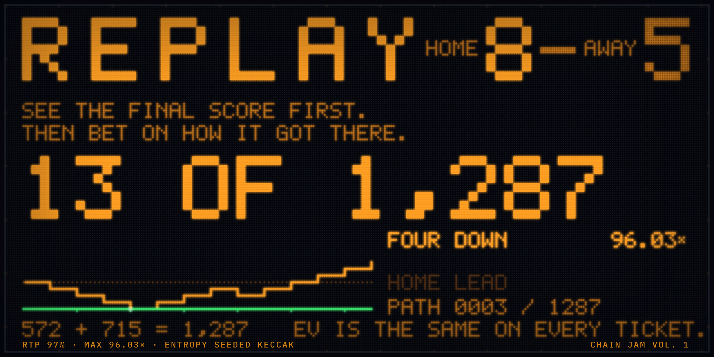

<div align="center">


# REPLAY

**See the final score first. Then bet on how the game got there.**



All 1,287 orderings on the 8–5 board were swept against the deployed facet: exactly **13**
win, matching `C(13,1)`, and each pays the **96.03×** cap to the wei. Reproduce it with
`npm test`.

<br/>

[](https://replay.edycu.dev)
[](./DEMO.md)
[](./FEEDBACK.md)
[](https://jam.chain.wtf)

<br/>


[](https://opensource.org/licenses/MIT)
[](https://github.com/edycutjong/replay/actions/workflows/deploy.yml)
[](https://github.com/edycutjong/replay/releases/latest)

</div>

---

## 💡 The Problem & Solution

### The Problem

Every casino game hides the outcome and shows you the odds. That forces the price to be an
estimate, and it forces the player to take the estimate on trust.

### The Solution

**Replay shows you the outcome and sells you the route.**

A 13-point game ends **8–5**. That is on the board before you bet a cent. What you wager on
is *which of the 1,287 orderings of those 13 points actually happened* — did the loser
strike first, was the winner never behind, did they climb out of a four-point hole.

The bet object does not exist in any casino or sportsbook. The primitive it rides on is a
scoreboard, which needs no explanation.

### Why the odds are an integer you can count

Because the score is revealed **before** the bet, the pricing problem stops being an
estimate and becomes counting. There are exactly `C(13,5) = 1,287` orderings that end 8–5,
and each proposition is a closed form over them:

| Ticket | Closed form | On 8–5 | Probability | Pays |
|---|---|---|---|---|
| `{LOSER} STRUCK FIRST` | `C(12, l−1)` | 495 | 38.462% | 2.52× |
| `NEVER BEHIND` | `C(13,l) − C(13,l−1)` | 572 | 44.444% | 2.18× |
| `CAME BACK` | `C(13, l−1)` | 715 | 55.556% | 1.75× |
| `TWO DOWN` | `C(13, l−2)` | 286 | 22.222% | 4.37× |
| `THREE DOWN` | `C(13, l−3)` | 78 | 6.061% | 16.01× |
| `FOUR DOWN` | `C(13, l−4)` | **13** | **1.0101%** | **96.03×** |

**RTP is 97% by construction, not by calibration.** Every price is `0.97 / p`, so
`E[return] = p × (0.97/p) × wager = 0.97 × wager` on all 25 (board, prop) pairs. That is
one line in the contract:

```solidity
expectedPayout = (wager * RTP_NUM) / RTP_DEN;   // RTP_NUM = 97, RTP_DEN = 100
```

`96.03×` is exact: `0.97 × (1287/13) = 0.97 × 99`. The whole paytable is arithmetic you can
redo by hand — and `npm test` redoes it for you.

## 🏗️ Architecture & Tech Stack

```
contracts/Replay.sol      ICasinoGameV2 — no constructor args, no loop over the ordering
                          space anywhere in the lifecycle. The heaviest operation in a
                          session is 13 iterations.
src/game/                 pascal · unrank · menu · codec · tempo — 100% covered
src/bridge/               useCasinoHost (penpal → chain.wtf) · demoHost (standalone)
src/render/               ONE renderer: 4 inks × 4 duty levels on an integer bulb lattice
src/audio/                three synthesis graphs, zero audio files
```

**Settlement is a bijection, not a shuffle.** A `bytes32` becomes a uniform rank by
rejection sampling over the sixteen 16-bit windows of the word (`byte % n` is forbidden and
is on the reviewer's checklist), and that rank unranks to a 13-bit path mask through the
combinatorial number system — exactly uniform *by construction* rather than by argument,
and it yields the shareable **PATH ID** for free.

**The contract writes the mask; the client renders it.** With a host present nothing about
the outcome is recomputed client-side.

## 🏆 Chain Casino SDK Integration

Three integration details worth checking:

1. **`quoteCaps`, `quoteRiskParams` and `onRandomness` all call one `_payout()`.** The
   facet caps payout at `escrowedStake + reservedProfit` with **zero slack**, so any
   independent re-derivation differing by a single base unit reverts every 96.03× win. We
   swept all 1,287 ranks on the 8-5 board: exactly 13 win, matching `C(13,1)`, and each
   pays the cap to the wei.
2. **`onRandomness` returns `reservedProfitDelta = 0`.** The host applies the delta
   *before* finalising, so releasing reserve there would collapse the cap to the wager and
   revert every win above 1×.
3. **`onSessionStart` is a pure function of `(wagerBase, gameData)`.** Production calls it
   twice, once as a simulation with `sessionId == 0`; it is idempotent by construction.

`npm run spike` exercises 9 `@chain/casino-sdk` symbols end to end.

> **CSP note for anyone redeploying:** `vercel.json` sets `Content-Security-Policy:
> frame-ancestors *` and *nothing else*, and there is no `X-Frame-Options` anywhere. A
> stray `SAMEORIGIN` from a framework preset wins in some browsers and silently costs the
> gallery's live preview.

## 📊 Engineering Rigor

| Measure | Result | How it is checked |
|---|---|---|
| Tests | **72 passing** | `npm test` — rebuilds the entire paytable from the closed forms |
| Game-logic coverage | **100%** | `npm run coverage` — statements, branches, functions, lines, thresholds enforced |
| Ordering sweep | **4,082** across all five boards | `npm run bench` Block A, brute force vs. the closed forms |
| Golden digests | **6 of 6** reproduced | combined `0x6ec73a1c…2720` over the 8,164-byte preimage |
| Cold open | **p95 65 ms** (budget 1,200) | `npm run bench` Block B, headless Chromium on the built `dist` |
| Replay frame | **p95 9.4 ms** (60 fps budget) | measured as real `rAF` deltas during a live round |
| UI gates | **9 of 9** | `npm run gates` — hue discipline, integer pitch, menu budget, embeddability |
| SDK symbols | **9 exercised** | `npm run spike` |

Absolute timings are machine-dependent and are not a claim about anything; the thresholds
are the claim, and a threshold miss fails the build.

## 🚀 Getting Started

### Prerequisites

Node 22+. The toolchain is Vite 7, React 19 and TypeScript in strict mode.

### Installation

```sh
npm install
npm run build && npm run preview
```

Or skip it entirely and open **[replay.edycu.dev](https://replay.edycu.dev)** — the game
runs standalone with no wallet and no host.

## 🧪 Testing & CI

For the reviewer, in under a minute:

```sh
npm test          # 72 tests. Rebuilds the entire paytable from the closed forms.
npm run coverage  # 100% on src/game/** — statements, branches, functions, lines
npm run spike     # 9 @chain/casino-sdk symbols exercised end to end
npm run bench     # the 4,082-ordering sweep, the golden digests, four render thresholds
npm run gates     # the nine mechanical ui.md gates
```

Full runbook, including a bet → VRF → payout round against the SDK's bundled simulator,
is in **[DEMO.md](./DEMO.md)**.

Every push runs **verify → release → deploy**: types, tests, the paytable block, the build,
the nine gates and the SDK spike, then a semantic-release version, then a deploy that
**re-reads the live origin** to confirm it still serves `frame-ancestors *`, the jam widget
tag exactly once in the raw HTML, and the manifest at the origin.

## 🎛️ Playing it

Open the URL. The posted score, the full priced menu and `13 OF 1,287 · 96.03×` are on
screen in **zero clicks** — no splash, no modal, no connect-wallet, no tutorial.

Pick a row. The 13 points then replay one at a time, and the pacing is derived from the
geometry rather than scripted: a beat that resolves your ticket gets a 180 ms pre-hold, a
beat that brings the line within one point of your row gets 320 ms, and a beat after your
ticket is already dead gets 90 ms — *unless* the line comes back and touches the row it
missed, which gets its own 500 ms in silence. That last one is the whole reason the tail
exists.

**Turn SOUND on.** The winner's point and the loser's point are different pitches, so a
comeback is audible with your eyes shut, and the crowd's gain tracks how far the line is
from your row. Scrubbing the menu is a rising scale: pitch is odds, and 96.03× is the top
note.

## 📐 Design

One direction sentence: **a 1977 stadium bulb-matrix scoreboard, shot on VHS in 1986.**

Four emissive inks (amber is fact, green is your claim alive, red is your claim dead, white
is the point being struck *this instant*), four duty levels, one typeface — a 5×7 bitmap
rendered as lamps — and integer pitch at every viewport. Hierarchy is carried by
*brightness*, never by size. There is exactly one gradient in the build: the boot wordmark,
for 400 ms, once per page load.

Amber shifts hue as it dims and the LEDs do not, because a tungsten filament cools down the
blackbody curve and an LED is spectrally narrow. It costs nothing and a reviewer can verify
it with a colour picker.

## 📄 License

MIT. Built for [Chain Jam Vol. 1](https://jam.chain.wtf).
